  

Good Morning! I'm Sven — Frontend Developer with a twist.  As a former engineer and head of embedded software department, I bring the technical know-how to break down complex tasks and make them accessible — from the lowest technical level all the way up to the end user.  Finally ~ I love the magic of coding! Making the invisible visible. → check it out <portfolio-link-in-progress>

###

<h2 align="left">Preferred Techs</h2>

###

    
    
    
    
    
    
    
    
    
    
    
    
    

###

<h3 align="left">More</h3>

###

  
  
  
  
  
  
  
  
  
  
  

###

<h2 align="left">Catch up with me</h2>

###

  
  
  
  

###
